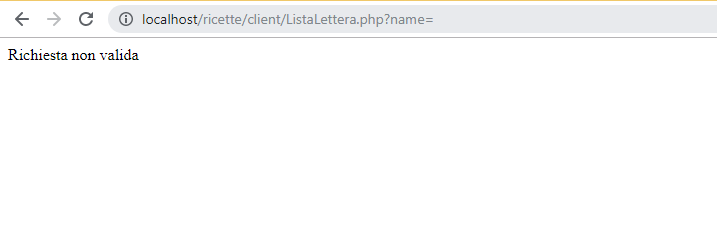
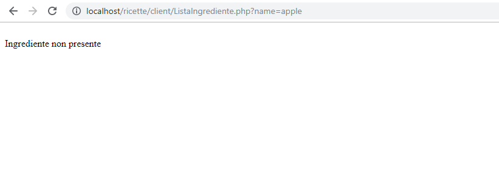
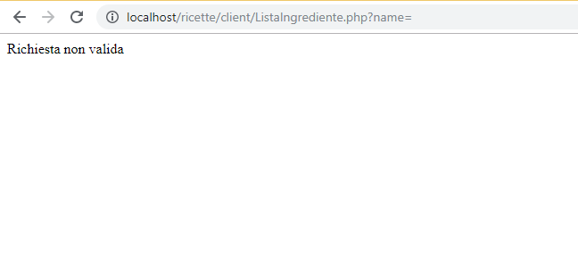
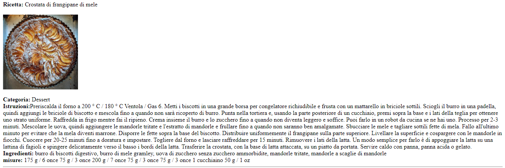
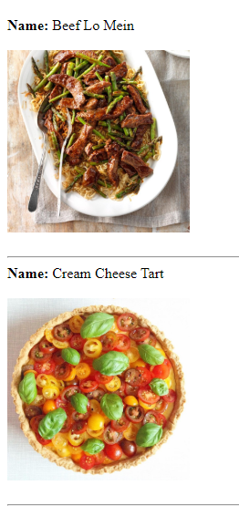

# Progetto  piattaforme digitali del territorio
# Descrizione
Creazione di un web service in grado di ricercare la ricetta di un pasto dato una lettera oppure un ingrediente.

Nella ricerca attraverso la lettera verranno mostrati come risultato : il nome del pasto, l'immagine, la ricetta, gli ingredienti e le dosi.
Mentre la ricerca attraverso un ingrediente darà come risultato il nome del pasto contenente l'ingrediente, la sua immagine e la ricetta 
# Architettura
Il codice è scritto in php e contiene anche delle parti in HTML. Le informazioni vengono acquisite da un API di database di ricette. 
All'interno della repository client si trovano i file : index.php , ListaIngrediente.php, ListaLettera.php.
## index.php
Il file è scritto in php, contiene l’inserimento della lettera o dell’ingrediente per la ricerca di un insieme di pasti.
## ListaLettera.php 
Il file è scritto in php; All'interno viene controllato se è stato inserito una lettera nel campo apposito, per effettuare la ricerca per lettera (iniziale del pasto);  se il controllo va a buon fine la lettera viene accodata all'url http://localhost/ricette/ws/GetLettera.php?name= , il quale verrà usato come parametro per la funzione file_get_contents che restituirà tutti i pasti che iniziano con la lettera indicata e le relative informazioni che mi interessa mostrare come risultato, in formato JSON.//
I risultati vengono decodificati e convertiti in un array associativo, attraverso la funzione json_decode e infine stampati a video.
## ListaIngrediente.php
Il file è scritto in php; All'interno viene controllato se è stato inserito il nome di un ingrediente nel campo apposito, per effettuare la ricerca tramite ingrediente del pasto; se il controllo va a buon fine il nome dell’ingrediente viene accodato all'url http://localhost/ricette/ws/GetIngrediente.php?name=, il quale verrà usato come parametro per la funzione file_get_contents che restituirà tutti i pasti con il nome dell'ingrediente indicato e le relative informazioni che mi interessa mostrare come risultato, in formato JSON.
I risultati vengono decodificati e convertiti in un array associativo, attraverso la funzione json_decode e infine stampati a video.
All'interno della repository ws si trovano i file : GetData.php, GetLettera.php e GetIngrediente.php.
## GetData.php
Il file è scritto in php e contiene due funzioni : 
- deliver_response : ha come parametri status (200, 204 oppure 400), status_message (rispettivamente a status : Presente, Assente, Richiesta non valida) e data (informazioni trovate). Restituesce l' array di risposta.
- getData : Ha come parametro l'url che a seconda della ricerca sarà : https://www.themealdb.com/api/json/v1/1/search.php?f= (+ la lettera  inserita dell'utente)oppure https://www.themealdb.com/api/json/v1/1/filter.php?i= (+ nome dell'ingrediente inserito dell'utente), legge il file di risposta JSON del link , decodifica e converte il risultato in un array associativo e lo restituisce.
## GetLettera.php
Il file è scritto in php; Accoda all'url https://www.themealdb.com/api/json/v1/1/search.php?f= la lettera  inserita dell'utente, lo passa alla funzione getData spiegata sopra e controlla il risultato:
- se la lista dei pasti trovati è vuota, la funzione deliver_response viene richiamata con i parametri 204, assente e NULL.

- se nella lista dei pasti trovati è presente almeno un pasto, la funzione deliver_response viene richiamata con i parametri 200, presente e le info trovate.
- se invece il campo nome è stato lasciato vuoto, la funzione deliver_response viene richiamata con i parametri 400, errore e NULL.
 
 

Contiene poi la funzione get_meals che ha come parametro il risultato completo della ricerca dei pasti e restituisce solo una parte di tutte le informazioni.
## GetIngrediente.php
Il file è scritto in php; Accoda all'url https://www.themealdb.com/api/json/v1/1/filter.php?i=il nome dell'ingrediente che l'utente vuole cercare, lo passa alla funzione getData e controlla il risultato:
- se la lista dei pasti trovati è vuota, la funzione deliver_response viene richiamata con i parametri 204, assente e NULL.

- se nella lista dei pasti trovati è presente almeno un pasto, la funzione deliver_response viene richiamata con i parametri 200, presente e le info trovate.
- se invece il campo nome è stato lasciato vuoto, la funzione deliver_response viene richiamata con i parametri 400, errore e NULL.
 

 
Contiene poi la funzione get_meals che ha come parametro il risultato completo della ricerca dei pasti e restituisce solo una parte di tutte le informazioni.
# Comunicazioni
Quando si inserisce il valore nel campo della lettera o dell'ingrediente e si esegue la ricerca, la richiesta alla API viene effettuata dalla funzioni getData che si trova all'interno del file getData.php, i risultati vengono poi selezionati dalla funzione get_meals che si trova all'interno del file getLettera.php e stampati da ListaLettera.php
# Documentazione API
* GetLettera.php : URL -> http://localhost/ricette/client/ListaLettera.php?name=
, la lettera che l'utente vuole cercare viene acquisito attraverso il metodo GET.
* GetIngrediente .php: URL ->http://localhost/ricette/client/ListaIngrediente.php?name=
, l'ingrediente che l'utente vuole cercare viene acquisito attraverso il metodo GET.

Esempi:
### Caso primo: ricerca pasto tramite ingrediente (egg)
URL : https://www.themealdb.com/api/json/v1/1/filter.php?i=egg
Risultato:
{"meals":[{"strMeal":"Beef Lo Mein","strMealThumb":"https:\/\/www.themealdb.com\/images\/media\/meals\/1529444830.jpg","idMeal":"52952"},{"strMeal":"Cream Cheese Tart","strMealThumb":"https:\/\/www.themealdb.com\/images\/media\/meals\/wurrux1468416624.jpg","idMeal":"52779"},{"strMeal":"Flamiche","strMealThumb":"https:\/\/www.themealdb.com\/images\/media\/meals\/wssvvs1511785879.jpg","idMeal":"52906"},{"strMeal":"General Tso's Chicken","strMealThumb":"https:\/\/www.themealdb.com\/images\/media\/meals\/1529444113.jpg","idMeal":"52951"},{"strMeal":"Katsu Chicken curry","strMealThumb":"https:\/\/www.themealdb.com\/images\/media\/meals\/vwrpps1503068729.jpg","idMeal":"52820"},{"strMeal":"Nanaimo Bars","strMealThumb":"https:\/\/www.themealdb.com\/images\/media\/meals\/vwuprt1511813703.jpg","idMeal":"52924"},{"strMeal":"Pad See Ew","strMealThumb":"https:\/\/www.themealdb.com\/images\/media\/meals\/uuuspp1468263334.jpg","idMeal":"52774"},{"strMeal":"Parkin Cake","strMealThumb":"https:\/\/www.themealdb.com\/images\/media\/meals\/qxuqtt1511724269.jpg","idMeal":"52902"},{"strMeal":"Peanut Butter Cookies","strMealThumb":"https:\/\/www.themealdb.com\/images\/media\/meals\/1544384070.jpg","idMeal":"52958"},{"strMeal":"Salmon Eggs Eggs Benedict","strMealThumb":"https:\/\/www.themealdb.com\/images\/media\/meals\/1550440197.jpg","idMeal":"52962"},{"strMeal":"Shrimp Chow Fun","strMealThumb":"https:\/\/www.themealdb.com\/images\/media\/meals\/1529445434.jpg","idMeal":"52953"},{"strMeal":"Sweet and Sour Pork","strMealThumb":"https:\/\/www.themealdb.com\/images\/media\/meals\/1529442316.jpg","idMeal":"52949"},{"strMeal":"Timbits","strMealThumb":"https:\/\/www.themealdb.com\/images\/media\/meals\/txsupu1511815755.jpg","idMeal":"52929"},{"strMeal":"Tourtiere","strMealThumb":"https:\/\/www.themealdb.com\/images\/media\/meals\/ytpstt1511814614.jpg","idMeal":"52926"}]}

### Caso secondo : ricerca pasto tramite lettera (e)
URL: https://www.themealdb.com/api/json/v1/1/search.php?f=e
Risultato:
strMeasure20 ":" "," strSource ":" "," dateModified ": null}, {" idMeal ":" 52888 "," strMeal ":" Eccles Cakes "," strDrinkAlternate ": null," strCategory ":" Dessert "," strArea ":" British "," strInstructions ":" Per preparare la pasta, taglia il burro a dadini e mettilo nel congelatore per farlo diventare duro. Punta la farina nella ciotola di un robot da cucina con metà del burro e pulsa fino alla consistenza del pangrattato. Versare il succo di limone e 100 ml di acqua ghiacciata e impastare fino a ottenere un impasto. Inclina il resto del burro e pulsa alcune volte fino a quando l'impasto è pesantemente macchiato di burro. È importante non esagerare con questo perché le chiazze di burro sono ciò che rende la pasta sfoglia. \ r \ nSu una superficie infarinata stendere la pasta in un rettangolo pulito di circa 20 x 30 cm. Piega le due estremità della pasta al centro (vedi foto 1), quindi piega a metà (foto 2). Stendi nuovamente la pasta e ripiegala nello stesso modo altre 3 volte riposando la pasta per almeno 15 minuti ogni volta tra il rotolo e la piega, quindi lascia riposare in frigorifero per almeno 30 minuti prima dell'uso. \ R \ nPer preparare il ripieno , sciogli il burro in una pentola capiente. Toglilo dal fuoco e aggiungi tutti gli altri ingredienti fino a quando non saranno completamente miscelati, quindi mettili da parte. \ R \ nPer preparare le torte, stendi la pasta fino a renderla leggermente più spessa di una moneta \ u00a31 e ritaglia 8 colpi circa 12 cm di diametro. Se necessario, ripetere il rifilo. Metti un buon cucchiaio colmo di miscela nel mezzo di ogni giro, spazzola i bordi dei giri con acqua, quindi raccogliere la pasta attorno al ripieno e strizzarla insieme (foto 3). Capovolgili in modo che la parte superiore liscia sia verso l'alto e picchiettali in un giro liscio. Appiattire ogni giro con un mattarello fino a un ovale fino a quando il frutto inizia a sbucare, quindi posizionarlo su una teglia. Tagliare 2 piccole fessure in ciascuna torta Eccles, spazzolare generosamente con l'albume e cospargere con lo zucchero (foto 4). \ R \ nRiscaldare il forno a una ventola di 220 ° C / 200 ° C / gas 8. Cuocere le torte Eccles per 15-20 minuti fino a poco oltre il marrone dorato e appiccicoso. Lascia raffreddare su una griglia e goditi mentre è ancora caldo o freddo con una tazza di tè. Se preferisci, anche le torte Eccles sono davvero ben servite con un cuneo di formaggio britannico duro e piccante come il Lancashire o il cheddar. "," StrMealThumb ":" https: \ / \ / www.themealdb.com \ / images \ / media \ / pasti \ /wtqrqw1511639627.jpg " "strTags":" strMeasure17 ":" " "strMeasure18": "", "strMeasure19": "", "strMeasure20": "", "strSource":" https: \ / \ / www.bbcgoodfood.com \ / ricette \ / 786.659 \ / eccles-cakes "," dateModified ": null}, {" idMeal ":" 52895 "," strMeal ":" English Breakfast "," strDrinkAlternate ": null," strCategory ":" Breakfast "," strArea ":" British "," strInstructions ":" Riscalda la piastra grill a fuoco basso, sopra 2 anelli \ / fiamme se si adatta, e spennella con parsimonia con olio d'oliva leggero. \ R \ nCrea prima le salsicce. Aggiungi le salsicce alla piastra grill calda \ / la parte più fredda se ce n'è una e lascia cuocere lentamente per circa 15-20 minuti, girando di tanto in tanto, fino a quando diventano dorate. Dopo i primi 10 minuti, aumentare il calore a medio prima di iniziare a cucinare gli altri ingredienti. Se stai lottando per lo spazio, cuoci completamente le salsicce e mantienili caldi su un piatto nel forno. \ R \ nSlolla alcuni piccoli tagli nel bordo grasso della pancetta. Metti la pancetta direttamente sul piatto della griglia e friggi per 2-4 minuti per lato o fino a quando non raggiungi la tua croccantezza preferita. Come le salsicce, la pancetta cotta può essere mantenuta calda su un piatto nel forno. Per i funghi, rimuovere lo sporco con un pennello da pasticceria e tagliare il livello del gambo con la cima del fungo. Salare, pepare e condire con un filo d'olio. Posizionare il gambo rivolto verso l'alto sulla piastra della griglia e cuocere per 1-2 minuti prima di girare e cuocere per altri 3-4 minuti. Evita di muovere troppo i funghi durante la cottura, poiché ciò rilascia i succhi naturali, rendendoli mollicci. Per i pomodori, tagliare i pomodori al centro \ / o a metà in senso longitudinale se si usano pomodori prugna e con un piccolo coltello affilato rimuovere l'occhio verde. Condire con sale e pepe e condire con un po 'di olio d'oliva. Metti la parte tagliata sul piatto della griglia e cuoci senza muoverti per 2 minuti. Girare delicatamente e condire di nuovo. Cuocere per altri 2-3 minuti fino a quando saranno teneri ma mantenendo comunque la loro forma. Per il budino nero, tagliare il budino nero in 3-4 fette e rimuovere la pelle. Posizionare sul piatto della griglia e cuocere per 1 \ u00bd-2 minuti per lato fino a quando diventa leggermente croccante. Per il pane fritto 'adeguato' è meglio cuocerlo in una padella separata. Idealmente, usa un pane vecchio di un paio di giorni. Scaldare una padella a fuoco medio e coprire la base con olio. Aggiungere il pane e cuocere per 2-3 minuti per lato fino a quando diventano croccanti e dorati. Se la padella diventa troppo asciutta, aggiungi un po 'più di olio. Per un sapore più ricco, aggiungi una noce di burro dopo aver ruotato la fetta. \ R \ nPer le uova fritte, rompi l'uovo direttamente nella padella con il pane fritto e lascialo per 30 secondi. Aggiungere una buona noce di burro e spruzzare leggermente \ / imbastire l'uovo con il burro quando sciolto. Cuocere al palcoscenico preferito, condire e rimuovere delicatamente con una fetta di pesce. \ R \ nUna volta che tutti gli ingredienti sono cotti, servire su piatti caldi e gustarli immediatamente con una buona spremuta di salsa ketchup o salsa marrone. "," StrMealThumb ": "https: \ / \ / www.themealdb.com \ / images \ / media \ / pasti \ /utxryw1511721587.jpg", "strTags": "colazione", "strYoutube": "https: \ / \ / www.youtube com \ / watch v = FXjYU2Ensck", "strIngredient1?": "Salsicce", "strIngredient2": "pancetta" mescolare sale e pepe regolati secondo le preferenze. Lasciar cuocere a fuoco lento per circa altri 2 minuti. \ r \ n \ r \ nDiscard Bay lascia, timo primavera e servire sopra i pesci con un lato di questo bammy. Puoi preparare la salsa con circa 2 giorni di anticipo. "," StrMealThumb ":" https: \ / \ / www.themealdb.com \ / images \ / media \ / meals \ /1520084413.jpg "," strTags ":" Frutti di mare, Spezie, Specialità, Pasqua "," strYoutube ":" https: \ / \ / www.youtube.com \ / watch? V = nF6DOtGE6k8 "," strIngredient1 ":" Red Snapper "," strIngredient2 ":" Olio vegetale "," strIngredient3 ":" Aglio "," strIngredient4 ":" Ginger "," strIngredient5 ":" Timo "," strIngredient6 ":" Foglia di alloro "," strIngredient7 ":" Pepe rosso "," strIngredient8 ":"

# Esempio : ricerca pasto attraverso la lettera
http://localhost/ricette/client/ListaLettera.php?name=a

# Esempio : ricerca pasto attraverso l'ingrediente
http://localhost/ricette/client/ListaIngrediente.php?name=egg

